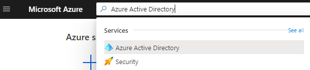
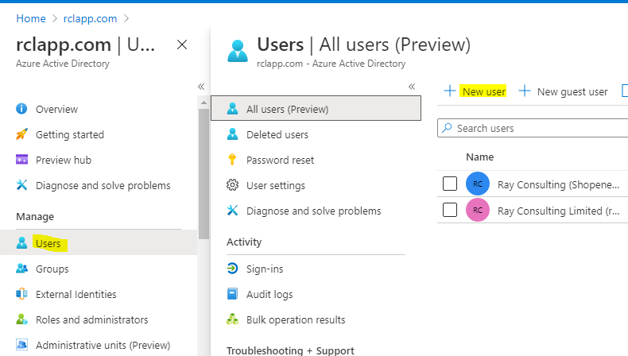
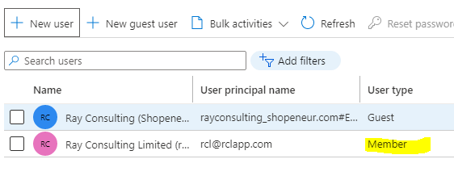
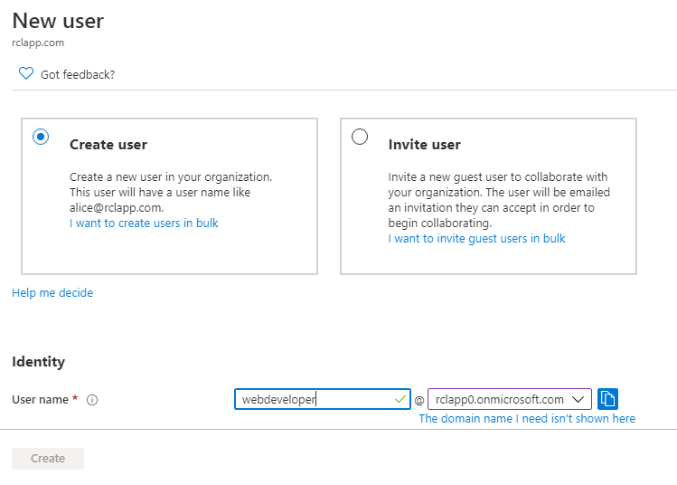

# Azure Active Directory Organization User Account

An Azure Active Directory (AAD) organization user account is required to sign in to RCL apps to manage Azure resources. An organization user account is also called a **‘Work or School’** account. Follow these steps to use an AAD user account in RCL apps.

- In the Azure Portal, search for the **Azure Active Directory** and open it

- In your **AAD Tenant**, click the ‘Users’ link

# Use an Exiting User Account

You can select an exiting user account who is a **Member** of the tenant to login to RCL apps. **Guest users cannot be used.**

# Create a New User Account

You can also create a new user account to sign in to RCL apps.

- Click the ‘New user’ link to create a new user

- Add the new user

- Ensure the new user is a **Member** in your organization

- You can use this new AAD organization user account to login in to any of the RCL apps.

# Sign In

To Access your Azure Resources with this new user account you will need to set up [Access Control for the AAD user](./access-control-user).

If you subscribed to an RCL app with a MSA account and need to manage Azure resources, you must [associate your AAD Work or school account with your subscription](./sign-in-accounts#associating-a-work-or-school-account-with-a-rcl-subscription).

It is strongly recommended that you sign in with this AAD Work or School account in the Azure Portal when you subscribe to any of the RCL apps in the Azure Marketplace.

# Access Control

In RCL apps, to access resources in you Microsoft Azure account a further step is required. Your AAD Work or School account must be an 'Administrator' or 'Owner' on the subscription containing your azure resources. 

Refer to the following link for more information :

- [Set Access Control for the AAD user](./access-control-user)

