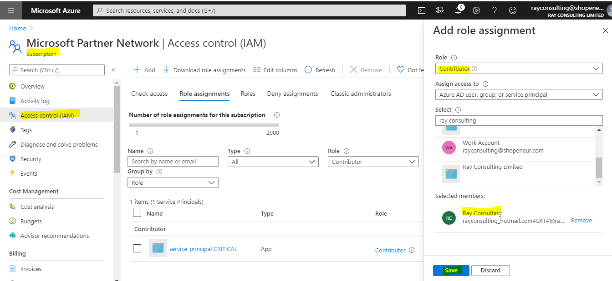

# Set Access Control for the AAD user

The Azure Active Directory (AAD) organization user account (Work or School) that you use to login to RCL apps must either be :

- An 'Administrator' or 'Owner' to your Azure subscription
- Have a role of ‘Owner’ or ‘Contributor’ to your Azure subscription

If either of these requirements are not met, you will not be able to use RCL apps to manage your Azure resources.

You may also experience an error message.

In this article, you will learn how to set access control for your AAD organization account (**AAD user**) to your Azure subscription.

You can select or create a new AAD account in your AAD tenant to sign in to RCL apps. Refer to the following link for more information :

- [AAD User Account](./aad-account-user)

# Subscription Administrator

You can determine if your AAD organization user account is an 'Administrator' or 'Owner' on the Azure subscription by logging in to the Azure portal with the same AAD user account that you use to login to to the RCL app.

- In the Azure portal, search for 'Subscriptions' and navigate to it

- Select a subscription

- After you select a subscription, click on the ‘My permissions’ link for the subscription

# Set Owner or Contributor roles

If the AAD user account that you use to log in to the RCL app is not an administrator in the Azure subscription, you need to add the AAD user account as an ‘Owner’ or ‘Contributor’ to the Azure subscription.

**To perform this action, you must login with an Administrator account in your Azure Active Directory Tenant**.

- Click on the the ‘Access Control (IAM)’ link in the Subscription 

- Click on the ‘Add’ link at the top to add a new role

- Add a 'Contributor’ or ‘Owner’ role assignment to your subscription for the AAD user account that you use to login to the RCL app

- You will see the new role assignment in the ‘Role assignments’ tab

**You must do this for each Azure subscription that you want to use in the RCL app.**

# Test Access Control

Once access control is properly set up for the AAD user account that you use to login to the RCL app, you can open any page in the RCL app that requires Azure subscription access to test it.

If the access control was correctly set, you will see the subscription in the drop down list.

