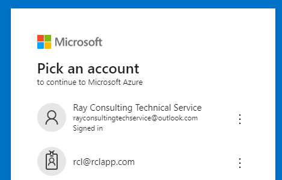
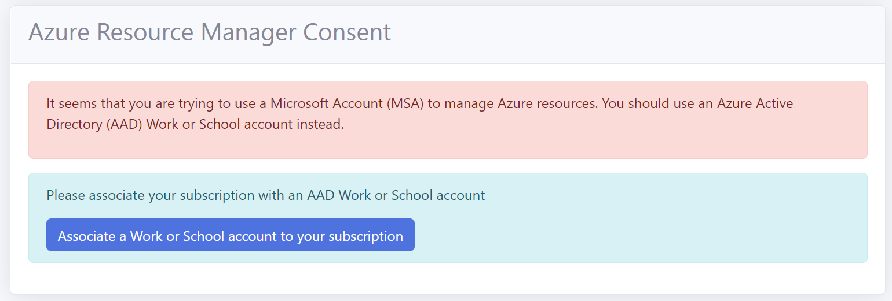
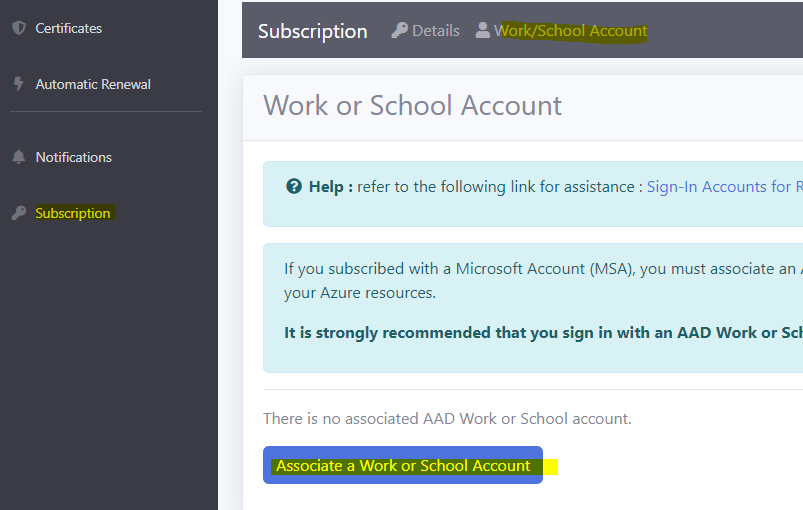
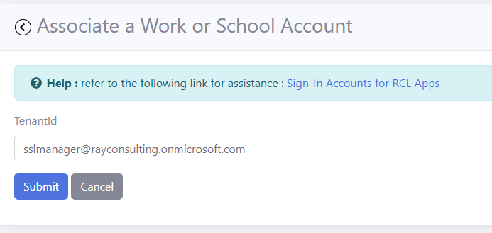

# Sign-In Accounts for RCL Apps

You can subscribe for, and sign in to an RCL app with :

- Azure Active Directory organization user account (Work or School)
- Microsoft personal account (MSA)

In the image above, the top account is a **MSA account** and the one below is a **Work or School account**. Work or School accounts are indicated by an 'id badge' image.

# Account Types

## Microsoft Accounts (MSA)

The MSA account is a personal Microsoft account. You usually register for one to use Microsoft consumer products such as Xbox, Outlook, Store, etc.

## Azure Active Directory Organization User Account

The AAD Work or School account is issued to users by an organization from their **Azure Active Directory Tenant**. 

These accounts are normally used to access enterprise resources and applications provided by organizations to their employees or students.

# Account Limitations

In RCL apps, MSA accounts **cannot** be used to Manage Azure Resources such as App Services, Key Vault, DNS, etc. You must use an AAD Work or School Account to manage these services.

If you try to manage an Azure Resource with a MSA account you will get the following error.

# Associating a Work or School Account with a RCL Subscription

If you subscribed to an RCL app with a MSA account, you must associate the RCL subscription with an AAD Work or School account to manage Azure resources in the RCL app.

This will allow you to login to your subscription with the AAD Work or School account and manage your Azure resources.

To associate an AAD Work or School account with a RCL subscription, follow these steps.

- Select or create a new AAD 'Work or School' account in your AAD tenant. Refer to the following link for more information :

- [Azure Active Directory Organization User Account](./aad-account-user)

- In the Subscription section of the RCL app, click on the 'Work/School Account' menu item. Then, click on the button to associate your AAD Work or School account

- Add the username of the AAD Work or School account to be associated with your subscription and click the submit button

- After the account is associated with your subscription, **sign in with the Work or School account in the RCL app**.

# Access Control

In RCL apps, to access resources in you Microsoft Azure account a further step is required. Your AAD Work or School account must be an 'Administrator' or 'Owner' on the subscription containing your Azure resources. 

Alternatively, you can assign the 'Contributor' or 'Owner' role to the Work or School account in your Azure subscription.

Refer to the following link for more information :

- [Set Access Control for the AAD user account](./access-control-user)

