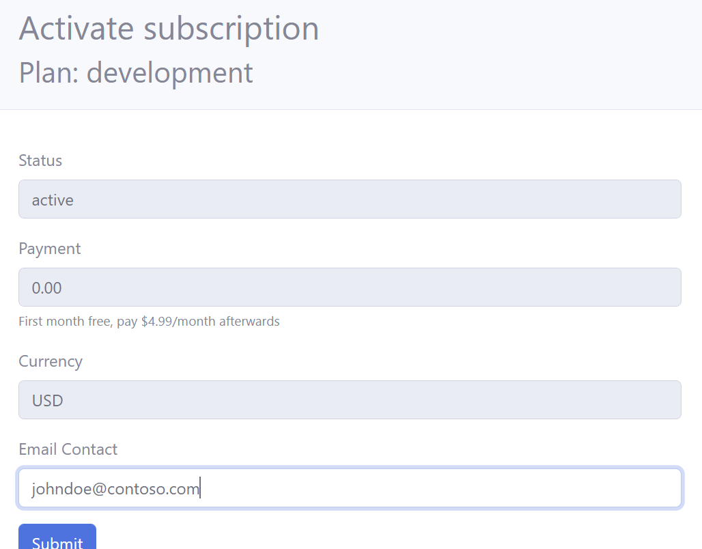
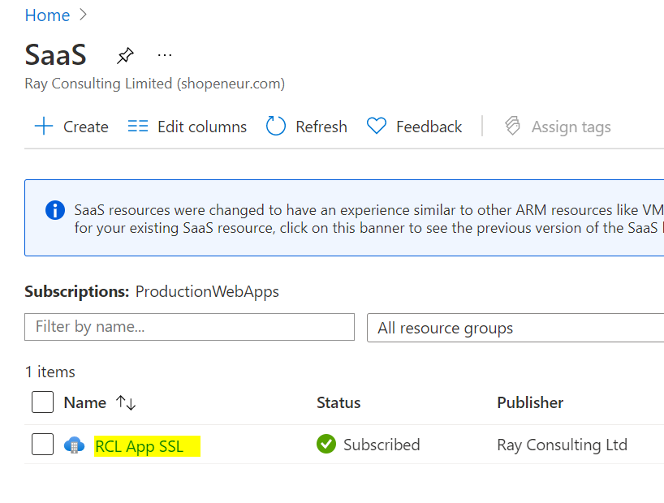
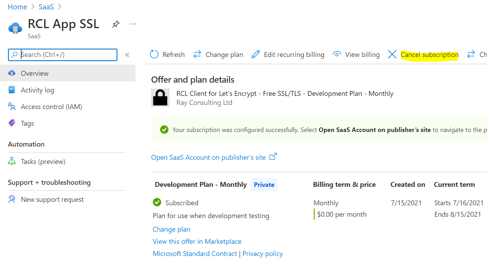

# Introduction 

In this section, you will learn how to subscribe to a RCL App in the Azure Marketplace.

# RCL Subscription

- In the Azure portal, search for the RCL App that you would like to subscribe to. Click on the ‘Setup+Subscribe’ button to add a subscription

- Complete the subscription and click the 'Review + subscribe' button

- Click the 'Subscribe' button when you are done

## Configure Account

- When the subscription in complete, click on the 'Configure account now' button to configure the RCL App

- In the RCL App, add a contact e-mail and click the 'Submit; button to activate the subscription

## Unsubscribe for a RCL App 

**You will unsubscribe for a RCL App in the Azure Portal.**

- You can access the RCL apps that you have subscribed to in the Azure portal.

- In the Azure portal, search for Software as a Service (SaaS) and open it

- In the SaaS page, select the RCL App

- In the SaaS details page, click the 'Cancel subscription' link to cancel the subscription

- Complete the questionnaire and cancel the subscription

